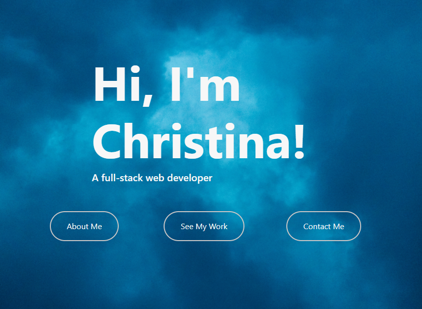
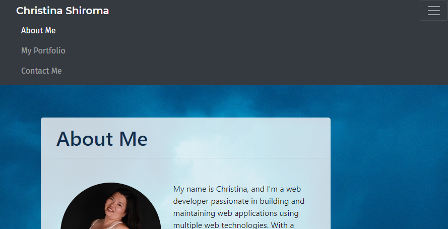
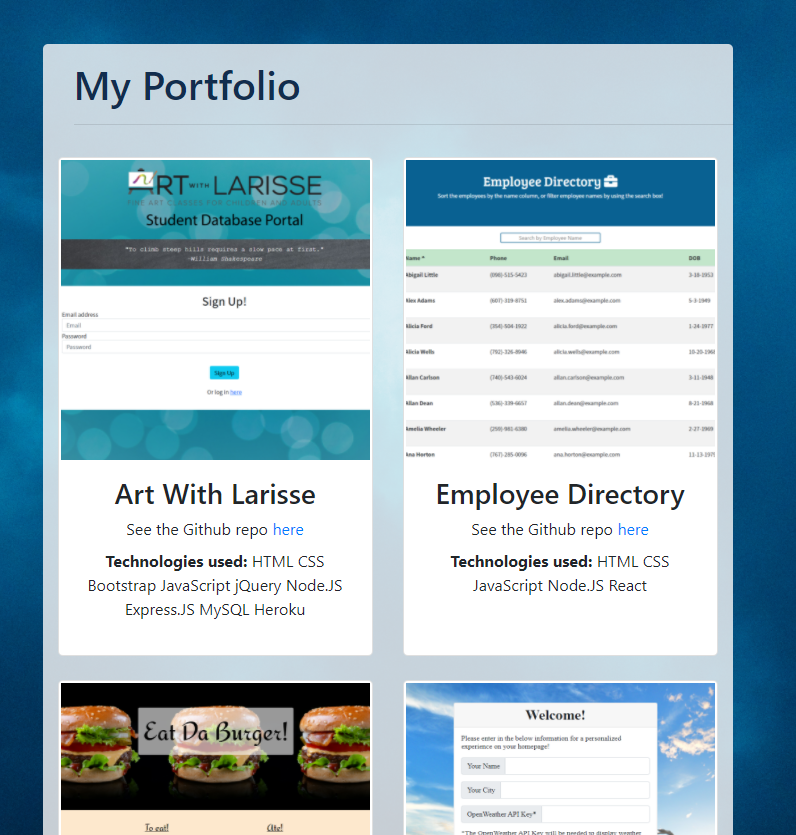
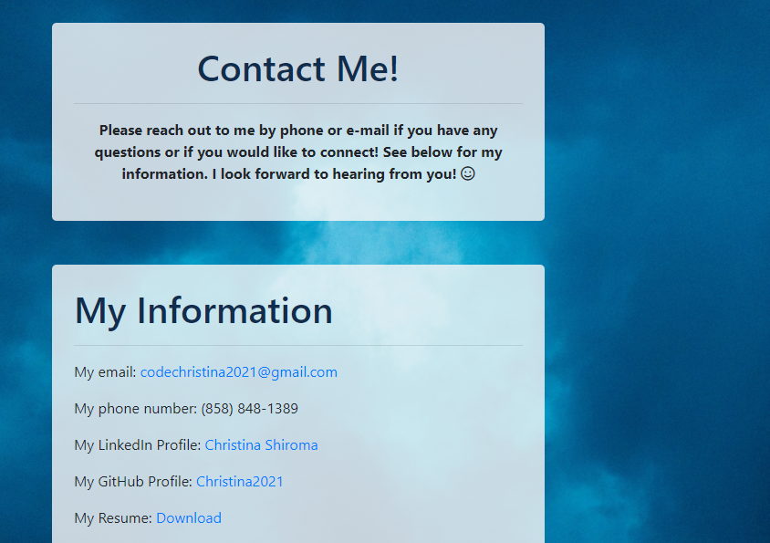
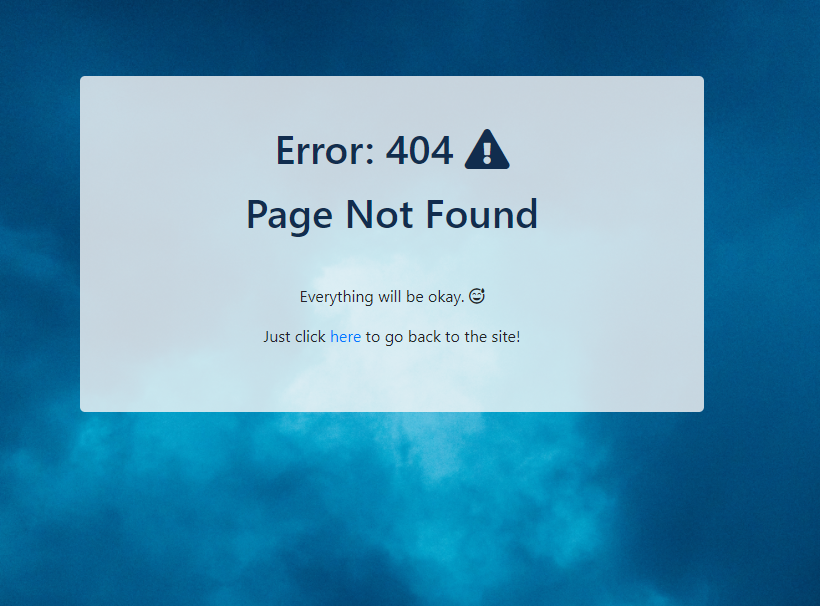

# React Portfolio

***
<p align="center">
  
</p>

[](https://opensource.org/licenses/MIT)



## Table of Contents
* [Description](#description)
* [Installation](#installation)
* [Usage](#usage)
* [Questions](#questions)
* [License](#license)

<br>

## Description
This portfolio is my personal portfolio built using React.  There will be an About Me page, a Portfolio page (that displays my projets), and a Contact Me page.

Feel free to check out the website [here](https://christina2021.github.io/react-portfolio/#/).
<br>

## Installation
If you are cloning this repo, please see the following command needed in order to use this application:<br>
```bash
npm i
npm start
```
This application will require Node.js.  Please make sure this is installed for the app to function properly.


## Usage
Please see the following instructions on how to use this application: <br>
⭐ Once the webpage has been opened, a short animation will occur for the splash page contents to appear.  There will be 3 buttons that will display and can be used to navigate to a specific page (pages may also be navigated using the navigation bar at the top of the following 3 pages).<br>
<br>
⭐ The About Me page will include a short bio.<br>
<br>
⭐ The Portfolio page will display some of the projects that I have worked on.  Hovering over the image will reveal a Demo button that will take the user to the live site.  The projects will also have a title, a link to the Github repos, and the different technologies used for the project.<br>
<br>
⭐ The Contact Me page will display my personal information (including an email, phone number, resume, and my LinkedIn and Github profiles).<br>
<br>
⭐ Should the user somehow end up navigating away from the main pages, they will encounter this 404 error page with a link to take them back to the splash page.<b

## Questions?
Feel free to check out my github profile [here](https://github.com/Christina2021)!
Should you have any questions, you may reach me by e-mail at: <a href="mailto:codechristina2021@gmail.com">codechristina2021@gmail.com</a>!

## License
[MIT](https://choosealicense.com/licenses/mit/#)